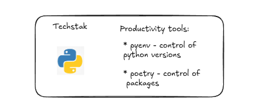
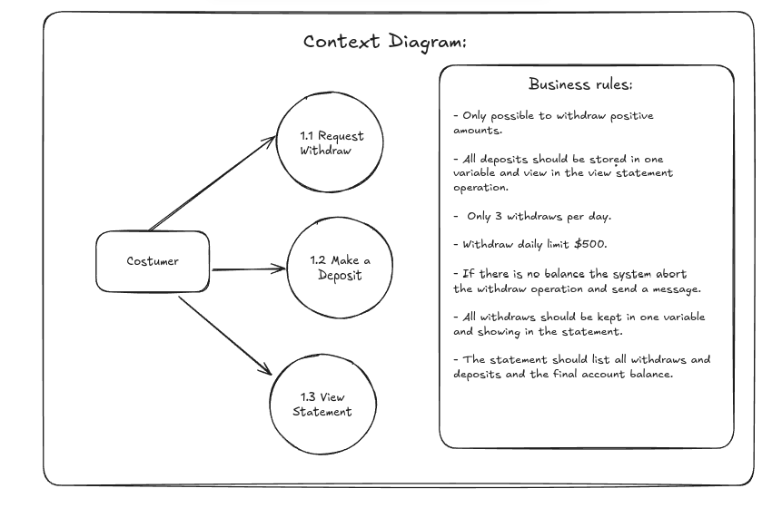

# A Bank System in Python

In this project implemets a traditional Bank System example.
But with some inovation 😏...

First, by adding the pyenv and poetry as the techstack for a modern version and depency control. See [here](https://medium.com/@itairaest/exploring-poetry-to-create-a-new-python-project-9e37723613a2) how this habits have started.
Why? Shortly, because it is a modern approch for Python projects and : 
 - By using pyenv in my Linux machine I can isolate my used Python version.
 - By using poetry the dependency management and packaging is smooth and organized in a .toml file.

Second, we decide backing  my old habit of make a functional diagram for better understanding of the problem. In this case I choose a context diagram, to remember my begining in the IT world... ☺️

The above diagram shows we will create 3 options for our costumer:
    - Request withdraw;
    - Make a deposit;
    - View statment.
You can check the business rules in the diagram as well. 

This project will be improved in each version, each one well organized in separated directories. In each directory you will find instructions to run it. 

## Author:
Itaira Santos 